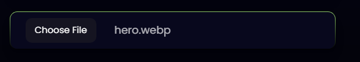

This is a [Next.js](https://nextjs.org/) project bootstrapped with [`create-next-app`](https://github.com/vercel/next.js/tree/canary/packages/create-next-app).

## Getting Started

First, run the development server:

```bash
npm run dev
# or
yarn dev
```

Open [http://localhost:3000](http://localhost:3000) with your browser to see the result.

You can start editing the page by modifying `pages/index.js`. The page auto-updates as you edit the file.

[API routes](https://nextjs.org/docs/api-routes/introduction) can be accessed on [http://localhost:3000/api/hello](http://localhost:3000/api/hello). This endpoint can be edited in `pages/api/hello.js`.

The `pages/api` directory is mapped to `/api/*`. Files in this directory are treated as [API routes](https://nextjs.org/docs/api-routes/introduction) instead of React pages.

## Learn More

To learn more about Next.js, take a look at the following resources:

- [Next.js Documentation](https://nextjs.org/docs) - learn about Next.js features and API.
- [Learn Next.js](https://nextjs.org/learn) - an interactive Next.js tutorial.

You can check out [the Next.js GitHub repository](https://github.com/vercel/next.js/) - your feedback and contributions are welcome!

## Deploy on Vercel

The easiest way to deploy your Next.js app is to use the [Vercel Platform](https://vercel.com/new?utm_medium=default-template&filter=next.js&utm_source=create-next-app&utm_campaign=create-next-app-readme) from the creators of Next.js.

Check out our [Next.js deployment documentation](https://nextjs.org/docs/deployment) for more details.


# `Custome file input component`



```jsx
          //components\Estimate\ContactForm.jsx

          const ContactForm = ()=> {
               const inputref = useRef();
               const [fileText, setFileText] = useState('No file chosen');
               
               const handleFileChange = (e) => {
                    setQuery((prevState) => ({
                         ...prevState,
                         file: e.target.files[0],
                    }));

                    if (inputref.current.value) {
                         setFileText(
                              inputref.current.value.match(/[\/\\]([\w\d\s\.\-\(\)]+)$/)[1]
                         );
                    } else {
                         setFileText('No file chosen');
                    }
               };
               return (
     
               	<div className='input flex items-center'>
					<input
						type='file'
						onChange={handleFileChange}
						className='hidden'
						ref={inputref}
					/>

					<button
						className='font-poppins font-[400] text-[12px] leading-[21px] bg-[#151421] py-1.5 px-3 rounded-lg'
						onClick={() => inputref.current.click()}
						type='button'
					>
						Choose File
					</button>
					{/* {console.log(inputref)} */}
					<span className='font-poppins text-[14px] leading-[21px] opacity-70 ml-6'>
						{fileText}
					</span>
				</div>

)

          }
			

```